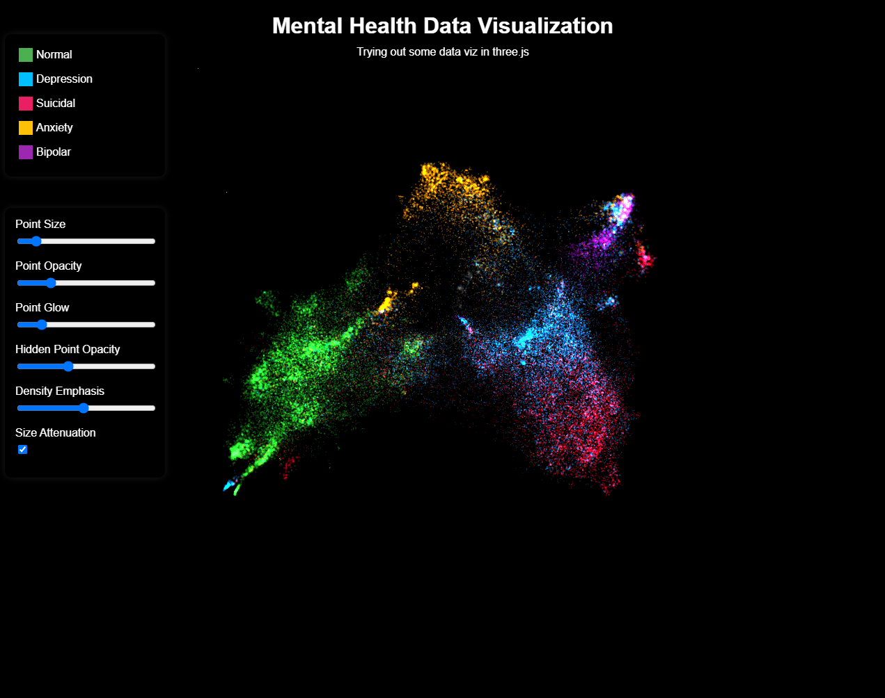

# dataviz

Downloads, embeds and reduces the dimensions of the [Sentiment Analysis for Mental Health dataset](https://www.kaggle.com/datasets/suchintikasarkar/sentiment-analysis-for-mental-health) from Kaggle.
Then, it visualises the data in a 3D scatter plot using [Three.js](https://threejs.org/).

## Setup

**Install dependencies**
> poetry install
> sudo chmod +x scripts/download-dataset.sh
> npm install

**Prep Data**
> ./scripts/download-dataset.sh
> python scripts/embed_data.py
> python scripts/reduce_dimensions.py

**Run the web app**
> npm start